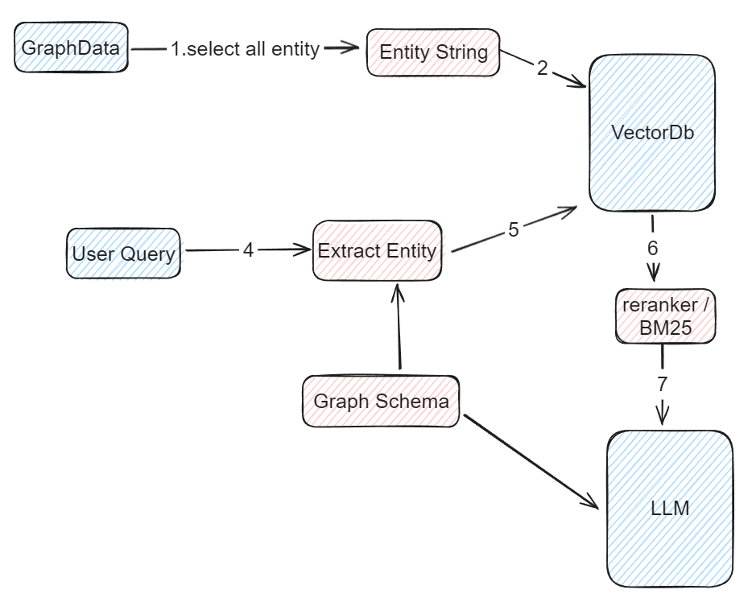
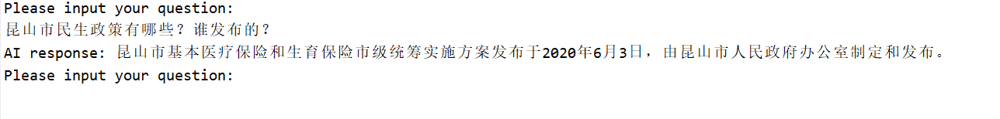

# Graph2Vector

A program designed to convert knowledge graph data into vector representations. 

## Introduction
Graph2Vector serves as a bridge between knowledge graph data and vectorized representations, enabling LLM-based RAG question-answering functionality.

## Usage
1. **Download** the source code: `git clone https://github.com/GrisaiaEvy/graph2vector.git`
2. **Configure**: Set up the necessary parameters and configurations according to your requirements in `main.rs`.
3. **Run**: Execute `main.rs` to initialize the program and interact with the AI for question-answering capabilities.

## Test
**Neo4j**: v4.4.4

**Embedding Model**: Xenova/bge-small-zh-v1.5

**Milvus**: v2.3.1 

**LLM**: gpt-3.5-turbo

**Test on chinese knowledge graph.**

## Roadmap
- [ ] **Add BM25 Support**: Implement support for BM25, a ranking function used in RAG retrieval.
- [ ] **Enhance Graph Database Support**
- [ ] **Enhance Embedding Models Support**

## License
[MIT license](https://opensource.org/licenses/MIT)
